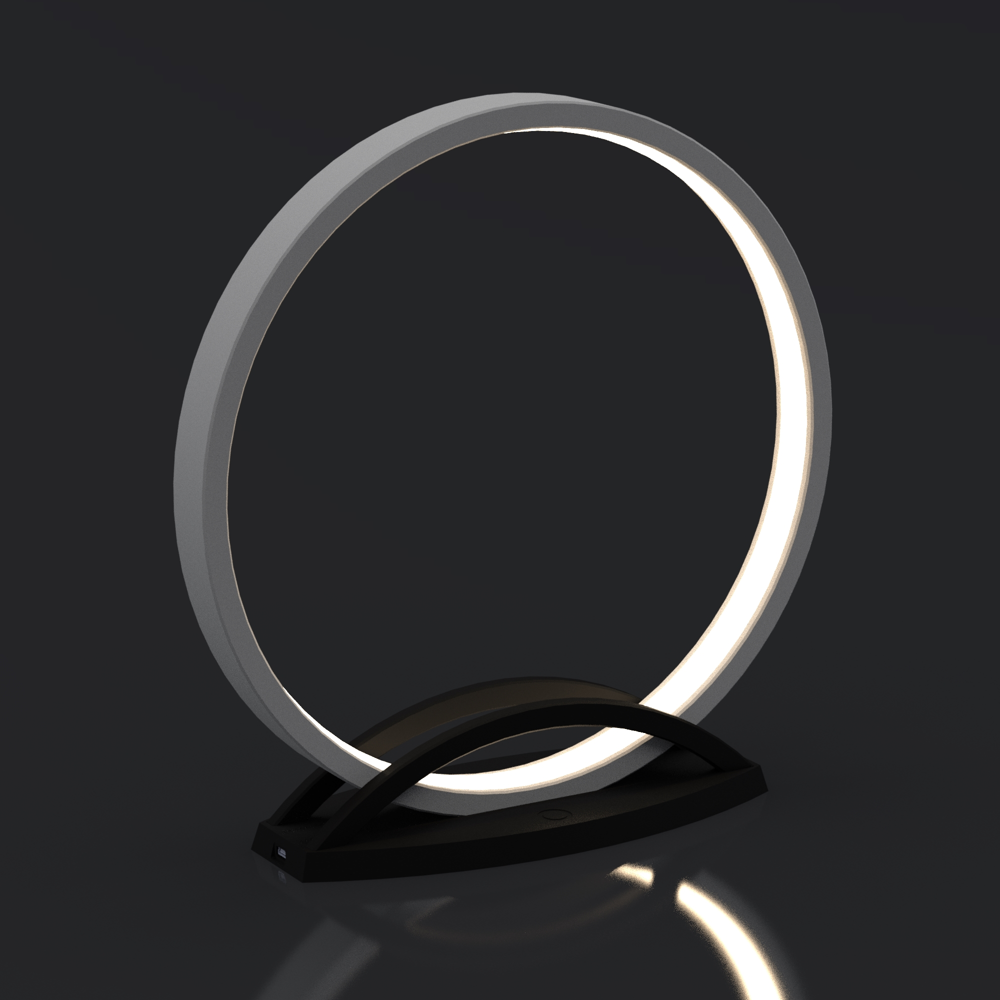

# CircleLamp

A circular lamp using LED strip inspired by [this design by minchang kwon](https://www.thingiverse.com/thing:4659384).

[Photos on my website](https://galerie.strangeplanet.fr/index.php?/category/203)

There are two versions of the base :

- one for a adressable LED strip + Arduino Nano
- one for a simple 12V strip + dimmer

## Parts list

### 3D printed parts

- 3x arc
- 1x arc-wire
- 1x support or support2
- 2x support-arc

### Electronics

- Adressable version
  - 1 meter SK6812 WWA LED strip (60 LEDS/m)
  - 1x Arduino Nano
  - 1x TTTP223 touch button
  - 1x Micro-USB breakout
  - 1x 2A USB wall adapter + USB cable
- Simple version
  - 1 meter natural white 12v LED strip ([COB strip](https://aliexpress.com/item/4000145232270.html) prefered)
  - 1x [capacitive dimmer](https://aliexpress.com/item/1005002395129687.html)
  - 1x 5.5mm DC Jack
  - 1x 2A 12V wall adapter

### Hardware

- 1 meter T2016 LED Strip tube (cut the white part with an utility knife)

## Controls (adressable version only)

**Single touch**  
On/Off

**Long touch (< 1s)**  
Next mode

- Mode 0 : full brightness (default)
- Mode 1 : static configurable temperature
- Mode 2 : "rainbow" of temperatures
- Mode 3 : candle animation

**Long touch (> 1s)**  
Increase/decrease brightness

**Double touch**  
Enter config mode. The ring will blink three times, double touch again to exit config, the ring will blink twice.

- Mode 0 : not configurable
- Mode 1 : long touch to change the temperature
- Mode 2 : not configurable
- Mode 3 : not configurable

 
  
Mermaid

  

## License

The SolidWorks files and Arduino code are distributed under the Creative Commons 3.0 BY-SA license.
