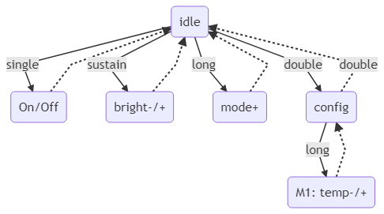
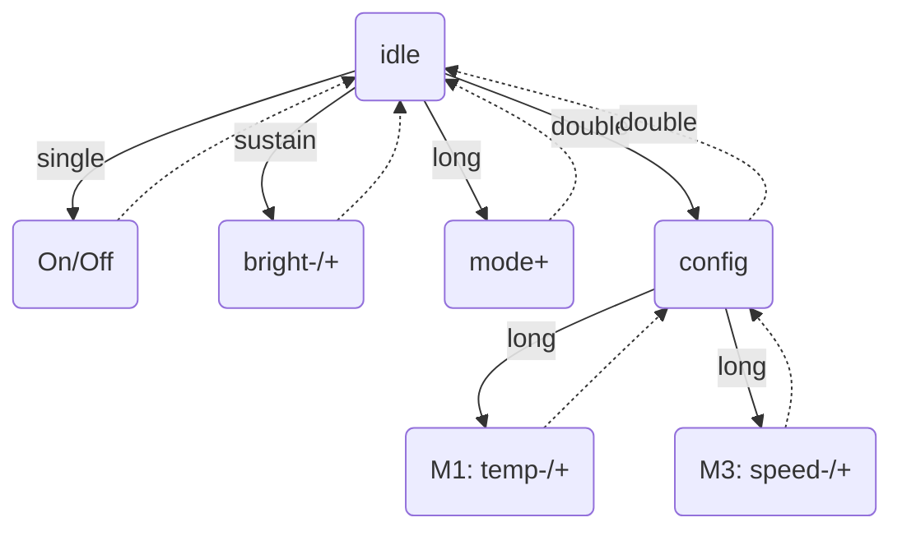

# CircleLamp

A circular lamp using Cold White/Warm White/Amber LED strip.

## Parts list

### 3D printed parts

- 3x arc
- 1x arc-wire
- 1x support
- 2x support-arc
- 1x support-lock

### Electronics

- 1 meter SK6812 WWA LED strip (60 LEDS/m)
- 1x Arduino Nano
- 1x TTTP223 touch button
- 1x Micro-USB breakout
- 1x 2A USB wall adapter + USB cable

### Hardware

- 2x M4 screws
- 1 meter T2016 LED Strip tube (cut the white part with an utility knife)

## Assembly

Assembly is pretty straightforward. Glue the four arcs together as well as the support arcs in the support. Then glue and LED strip and place the diffuser (don't need glue if you cut it at the right size).

Solder the LED strip input to D2 and the button output to A6 and the power lines as usual.

Insert the ring the support and secure it with the support lock and two screws. The drop shapped hole in the support is meant to hold the original LED connector.

## Controls

**Single touch**  
On/Off

**Long touch (< 1s)**  
Next mode

- Mode 1 : static single temperature
- Mode 2 : "rainbow" of temperatures
- Mode 3 : rotating "rainbow" of temperatures

**Long touch (> 1s)**  
Increase/decrease brightness

**Double touch**
Enter config mode. The ring will blink three times, double touch again to exit config, the ring will blink twice.

- Mode 1 : long touch to change the temperature
- Mode 2 : not configurable
- Mode 3 : long touch to change to rotating speed

 
  
Mermaid

  

